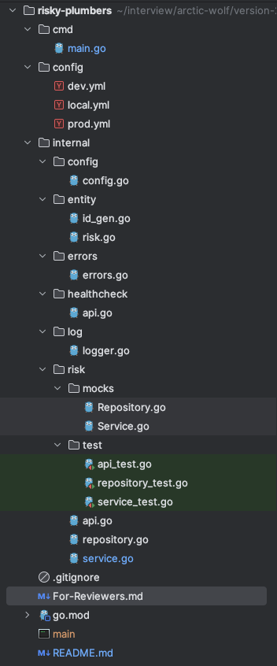

## Code Structure

This section explains the structure of the code. Below is the screenshot of the code directory structure.

| File/Directory            | Notes                                                                                                                                                                                                                                      |
|---------------------------|--------------------------------------------------------------------------------------------------------------------------------------------------------------------------------------------------------------------------------------------|
| cmd/main.go               | Contains the bootstrap code for the application                                                                                                                                                                                            |
| config                    | Folder containing environment specific configuration                                                                                                                                                                                       |
| internal/config/config.go | This component loads the provided application configuration. The application configuration can be provided using the command line parameter `--config` while starting the application.  The default configuration file is `config/local.yml` |
| internal/entity           | Folder containing the entity types                                                                                                                                                                                                         |
| internal/errors           | Folder containing the errors types and error responses                                                                                                                                                                                     |
| internal/healthcheck      | Healthcheck api implementation                                                                                                                                                                                                             |
| internal/log/logger.go    | Logger implementation using `zap`                                                                                                                                                                                                          |
| internal/risk             | Contains the components which implement the Risk API and the test cases                                 |

## Libraries Used
- https://github.com/spf13/viper: For loading the configuration
- https://github.com/go-chi/chi: For Http request routing
- https://github.com/go-ozzo/ozzo-validation: For validating struct values. This is used in `internal\risk\service.go`
- https://github.com/vektra/mockery: For generating the mocks

## Notes
- There are certain TODOS in the application which I wanted to implement but did not do that due to time constraints.
